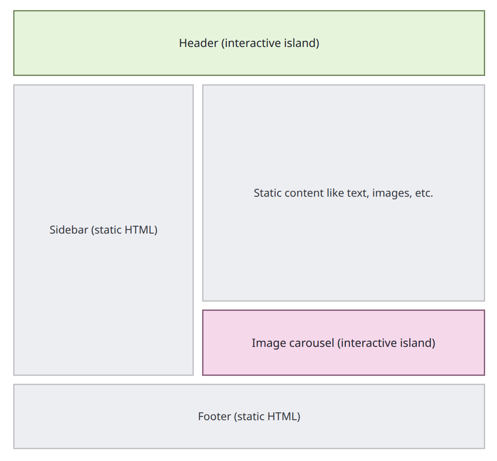
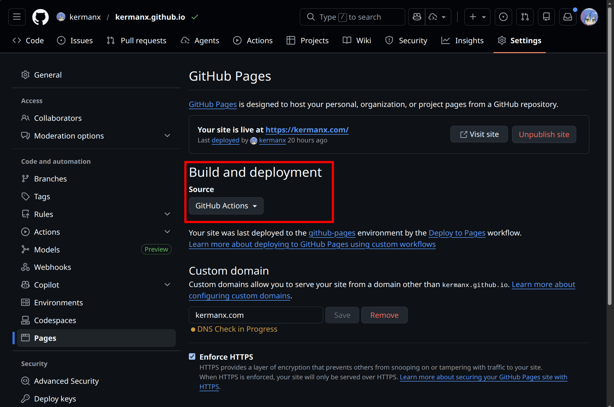
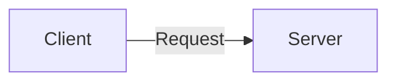
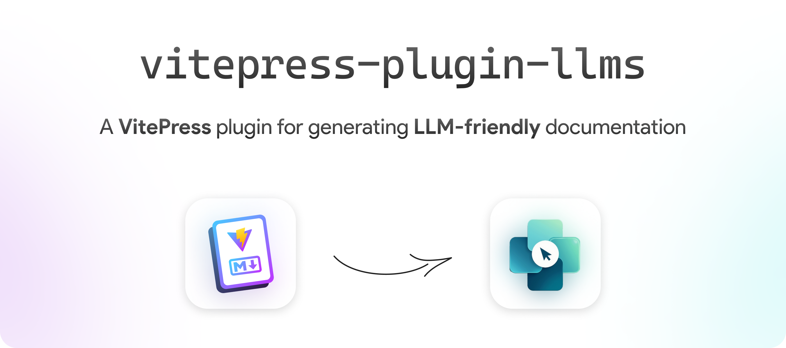

# 现代静态网站构建


---
layout: outline
---

---

- Web 的一些基础概念：CSS HTML JS、SPA vs MPA、SSG vs SSR vs CSR
- 一些博客生成框架的简略介绍（Jekyll Hexo Hugo Astro）
- 重点介绍：VitePress (Live Demo)
- 部署：CI、托管平台（GH Pages, Netlify, Vercel, Cloudflare）、域名、Analytics
- 其他：VitePress 插件（Nolebase、Mermaid）、Opengraph、AI（搜索、总结、交互式拓展内容）

---
layout: section
---

# Web 基础概念

---
layout: image
image: /slide-1.png
title: HTML CSS JS
level: 2
navigation: false
hide: true
---

---
title: SPA MPA
level: 2
---

## Single Page Application (SPA)

```
https://example.com/pageA ──╮
https://example.com/pageB ──┼--> index.html
https://example.com/pageC ──╯
```

- 所有页面都由一个 HTML 文件加载，并通过 JavaScript 动态更新内容。
- 页面切换更快，但可能会对 SEO 和初始加载时间产生影响。

## Multi Page Application (MPA)

```
https://example.com/pageA -----> pageA.html
https://example.com/pageB -----> pageB.html
https://example.com/pageC -----> pageC.html
```

- 每个页面都有自己的 HTML 文件，用户访问不同的 URL 时会加载不同的页面。
- 适合内容较多的网站，SEO 友好，但可能会导致页面切换时的加载时间较长。


---
class: p-4
title: SSR CSR
---

<div grid grid-cols-2 gap-10 mx--4><div>

## Server-Side Rendering (SSR)

```
User     Server    Database
 │          │         │
 │─Request->│         │ /product/123
 │          │         │
 │          │──Query->│ SELECT ... WHERE id=123
 │          │         │
 │          │<-Result─│ {name: "A", price: 10}
 │          │         │
 │<--HTML───│         │ <div>Price: $10</div>
```

</div><div>

## Client-Side Rendering (CSR)


```
User      Server    Database
  │          │         │
  │─Request->│         │ /product?id=123
  │          │         │
  │<-HTML+JS─│         │ (product.html + app.js)
  │          │         │
  │─Request->│         │ /api/product/123
  │          │         │
  │          │──Query->│ SELECT ... WHERE id=123
  │          │         │
  │          │<-Result─│ {name: "A", price: 10}
  │          │         │
  │<-Data────│         │ {price: 10}
  │          │         │
```

</div></div>

<style>
pre {
  --slidev-code-font-size: 0.7em;
}
</style>


---

## \{SPA,MPA\}$\times$\{CSR,SSR\}

<div h-4 />

| 类型 | 典型代表 | 说明 |
|---|---|---|
| SPA + CSR | 大部分应用 | 只有一个 HTML，所有数据在客户端通过API获取<br>前后端分离，开发灵活 |
| SPA + SSR | Next.js Nuxt.js | 首屏 SSR，后续采用 SPA 模式<br>客户端与服务器**同构渲染**（现代的终极形态） |
| MPA + CSR | 比较少见 | - |
| MPA + SSR | PHP, Java (JSP), Python (Django) | 传统网站，每次跳转都要重新请求完整页面并刷新 |

根本矛盾：用户体验/SEO vs 开发难度

<div v-click text-2xl mt-8>

但是如果是静态网站，根本不需要动态数据？

</div>

---
title: Static Site Generation
---

# Static Site Generation (SSG)

- 既然没有动态数据，不如预先生成所有页面

- 不需要服务器逻辑，也不需要客户端渲染

- Static Data Only: 每次内容更新都需要重新构建整个站点


- Jekyll / Hexo / Hugo: Markdown + template + static JS <carbon-arrow-right /> static website


<div v-click mt-8>

听起来很完美，但是有两大问题：

- 往往需要一些动态数据（例如评论、搜索、交互式内容等）

- 即使是静态页面，也需要有“组件化”的能力，否则维护起来会非常麻烦

</div>

---
layout: two-cols
---

# Astro

https://docs.astro.build/en/concepts/islands/



::right::

<div h-12 />

- 组件化开发，支持 React/Vue/Svelte 等多种框架

- Islands 架构：只有交互式组件才会被客户端渲染，其他部分完全静态

- 默认 0 JS

- Markdown 支持完善，也可以用来构建博客


---

# VitePress

<div text-xl>

- General-purpose: 不仅适合文档，也适合博客、个人主页

- Simple: 开箱即用

- Fast

- Modern

- Customizable

</div>

## Why not VitePress

- 没有内置的博客功能（分类、时间线、评论等） <del op-60> (不过反正也写不了几篇博客)</del>

- 主题较少

---
layout: section
---

# VitePress 站点示例

---
layout: iframe
title: vitepress.dev
url: https://vitepress.dev/
navigation: false
scale: 0.65
---

---
layout: iframe
title: kermanx.com
url: https://kermanx.com/
navigation: false
scale: 0.65
---


---
layout: iframe
title: nolebase.ayaka.io
url: https://nolebase.ayaka.io/
navigation: false
scale: 0.65
---

---
layout: section
---

# 创建 VitePress 项目

---

# 安装 Node.js

- [nodejs.org](https://nodejs.org/)

- Windows: https://nodejs.org/dist/v24.14.0/node-v24.14.0-x64.msi

- Linux: fnm

  ```sh
  export FNM_NODE_DIST_MIRROR=https://mirrors.ustc.edu.cn/node/
  curl -o- https://kermanx.com/ssg-workshop/fnm | bash
  fnm install 24
  node -v
  ```

---

# 初始化项目

<AINote title="如何运行命令？" float-right>

1. 在文件资源管理器中，新建并打开你想放置代码的文件夹。

2. 右键选择 “在终端中打开”

3. 在打开的终端中输入命令并回车执行。

</AINote>

## 方法1：手动创建

```sh
# 在一个新文件夹中运行以下命令
pnpm init
pnpm add -D vitepress
pnpm vitepress init
```

<div h-4 />

## 方法2：使用模板 （[预览](https://kermanx.com/starter-vitepress/)）

<AINote title="如何 Fork 仓库？" float-right mt-4>

1. 访问 https://github.com/kermanx/starter-vitepress

2. 点击右上角的 "Fork" 按钮，选择你的 GitHub 账号。
    uwu
3. 你会被重定向到你自己的仓库页面

</AINote>

1. Fork https://github.com/kermanx/starter-vitepress <span op-70 ml-2> (to `username.github.io`?) </span>

2.  
    ```sh
    git clone your-forked-repo-url my-blog
    cd my-blog
    pnpm i
    ```

---
hide: true
---

# 链接本地文件夹

相关数据不会被上传到服务器，完全在浏览器本地处理。

<WorkspaceSelector />

---
layout: section
---

# 开发 VitePress 项目

---

# 启动开发服务器

1. 打开 VS Code

```sh
code .
```

<div h-4 />

2. 启动开发服务器

```sh
pnpm docs:dev    # 或者简化为 pnpm dev
```

<AINote title="简化这个命令为 pnpm dev">

在 package.json 中修改 `"scripts"` 部分：

  ```json
  "scripts": {
    "dev": "vitepress dev"
  }
  ```

这样你就可以直接运行 `pnpm dev` 来启动开发服务器了。模板中已经做了这个修改，可以直接使用 `pnpm dev`。

<!-- <AddDevScriptButton /> -->

</AINote>

<div h-4 />

3. 在浏览器中访问 http://localhost:5173 （也可能是终端显示的其他端口）

    任何修改都会自动更新到浏览器中，可以实时预览效果。

---

# 项目目录结构

- `.vitepress/config.ts` - 配置文件

- `public/` - 静态资源

## 页面文件

```
index.md             -->  /index.html (accessible as /)
about.md             -->  /about.html
post/index.md        -->  /post/index.html (accessible as /post/)
post/hello-world.md  -->  /post/hello-world.html
```

<style>
pre {
  --slidev-code-font-size: 0.9em;
}
</style>

---
hide: true
---

# 配置网站标题与简介

<ConfigTitleEditor />

---

## 配置网站标题与简介

`.vitepress/config.ts`

```ts
export default defineConfig({
  title: "My Website",
  description: "This is a random website.",
  // ...
})
```


---

## 配置网站主页

`index.md`

```md
---
layout: home

hero:
  name: "My Awesome Project"
  text: "A VitePress Site"
  tagline: My great project tagline
  actions: ...

features:
  - title: Feature A
    details: Lorem ipsum dolor sit amet, consectetur adipiscing elit
  - ...
---

```

---
routeAlias: sidebar-and-nav
---

## 配置侧边栏与导航栏

<table class="text-0.8em border-none!">
<thead>
</thead>
<tbody>
<tr>
<td><code>themeConfig.nav</code></td>
<td>导航栏配置</td>
<td>

```ts {*}{class:'w-125!'}
nav: [
  { text: "首页", link: "/" },
  { text: "指南", link: "/guide/" }
]
```

</td>
</tr>
<tr>
<td><code>themeConfig.sidebar</code></td>
<td>侧边栏配置</td>
<td>

```ts {*}{class:'w-125!'}
sidebar: {
  "/guide/": [
    { text: "快速开始", link: "/guide/quick-start" },
    { text: "配置", link: "/guide/config" }
  ]
}
```

</td>
</tr>
<tr>
<td><code>themeConfig.socialLinks</code></td>
<td>社交链接</td>
<td>

```ts {*}{class:'w-125!'}
socialLinks: [
  { icon: "github", link: "https://github.com/your-id" },
  { icon: "twitter", link: "https://x.com/your-id" }
]
```

</td>
</tr>
</tbody>
</table>

https://vitepress.dev/reference/site-config

<style>
pre {
  --slidev-code-font-size: 0.8em;
}
</style>

---

## 新建页面

1. 新建一个 Markdown 文件，例如 `post/hello-world.md`

2. 如有必要，将其内容添加到侧边栏或导航栏配置中 (<Link to="sidebar-and-nav">参考该幻灯片</Link>)

3. 在 Markdown frontmatter 中配置页面: (https://vitepress.dev/reference/frontmatter-config)

````md
---
title:   Docs with VitePress # optional
layout:  doc  # doc | home | page
outline: [2, 4]
navbar:  false
sidebar: false
aside:   false
footer:  false
prev:    # `false` to disable
  text:  'Markdown'
  link:  '/guide/markdown'
next:    # same as `prev`
---

````

<style>
pre {
  --slidev-code-font-size: 0.7em;
  margin-left: 32px;
  margin-right: 32px;
}
</style>

---

## 配置图标

在 `public/` 文件夹中放置 `favicon.svg` 和 `favicon-dark.svg`，并在配置文件中添加：

```ts
export default defineConfig({
  // ...
  themeConfig: {
    logo: {  // Or logo: "/favicon.svg" if you don't need dark mode support
      light: "/favicon.svg",
      dark: "/favicon-dark.svg"
    },
  },
  head: [
    ["link",{rel:"icon",href:"/favicon.svg"}],
    ["link",{rel:"icon",href:"/favicon-dark.svg",media:"(prefers-color-scheme: dark)"}],
    ["link",{rel:"icon",href:"/favicon.svg",media:"(prefers-color-scheme: light)"}],
  ],
})
```

---

# 其他配置

```ts
export default defineConfig({
  lastUpdated: true, // https://vitepress.dev/reference/default-theme-last-updated
  themeConfig: {
    editLink: {      // https://vitepress.dev/reference/default-theme-edit-link
      pattern: 'https://github.com/username/repo/edit/main/docs/:path',
      text: 'Edit this page on GitHub'
    },
    search: {        // https://vitepress.dev/reference/default-theme-search
      provider: 'local'
    },
    footer: {        // https://vitepress.dev/reference/default-theme-footer
      message: 'Released under the MIT License.',
      copyright: 'Copyright © 2019-present Evan You'
    }
  },
})
```

---

## 数学公式

https://vitepress.dev/guide/markdown#math-equations

```sh
npm add -D markdown-it-mathjax3@^4
```

```ts [./.vitepress/config.ts]
export default defineConfig({
  markdown: {
    math: true,
  },
})
```

````md
When $a \ne 0$, there are two solutions to $(ax^2 + bx + c = 0)$ and they are
$$
x = {-b \pm \sqrt{b^2-4ac} \over 2a}
$$
````

---

## Vue in Markdown

````md
<script setup>
import { ref } from 'vue'
import CustomComponent from '../components/CustomComponent.vue'
const count = ref(0)
</script>

## Markdown Content

The count is: {{ count }}. <button @click="count++">Increment</button>

<ClientOnly> <CustomComponent /> </ClientOnly>

<style module>
button { font-weight: bold; }
</style>
````

---
layout: section
---

# 部署站点

---

# GitHub Pages

- 适合个人项目，免费，简单

- 域名：
  
  <div font-mono>

    github.com/kermanx/my-blog -> kermanx.github.io/my-blog

    github.com/kermanx/**kermanx.github.io** -> kermanx.github.io

    (CNAME) -> 任意域名

  </div>

- 部署方式：
  
  - 将构建后的静态文件推送到 `gh-pages` 分支

  - **使用 GitHub Actions 自动部署 (CI)**

---

## 构建（编译?）

```sh
pnpm docs:build   # vitepress build
```

- 会在根目录下生成一个 `.vitepress/dist` 文件夹，里面包含了所有静态文件

### Base URL

- 部署到子路径（例如 GitHub Pages 的 `kermanx.github.io/repo-name/`），需要传入 `base`：

  ```sh
  vitepress build --base=/sub-path/
  ```

  否则，资源文件的路径会错误地指向 `/assets/...`，导致页面无法正确加载 CSS 和 JS。

### Public Folder

- 构建过程中会将 `public/` 文件夹中的资源复制到输出目录中，并且可以通过根路径访问。

- 比如可以将一个 PDF 文件放在 `public/` 中，然后在 Markdown 中通过 `/file.pdf` 来访问它。

- 但是如果 `base` 是 `/sub-path/`，那么访问路径应该是 `/sub-path/file.pdf` 😭

---

## GitHub Actions

新建一个 `.github/workflows/deploy.yml` 文件，内容如下：

```yaml {*}{maxHeight:'320px'}
name: Deploy to Pages

on:
  push:
    branches: ["main"]
  workflow_dispatch:

permissions:
  contents: read

concurrency:
  group: "pages"
  cancel-in-progress: false

jobs:
  build:
    runs-on: ubuntu-latest
    steps:
      - name: Checkout
        uses: actions/checkout@v5
        with:
          fetch-depth: 0  # https://vitepress.dev/reference/default-theme-last-updated#last-updated
      - name: Setup PNPM
        uses: pnpm/action-setup@v4
      - name: Setup Node
        uses: actions/setup-node@v4
        with:
          node-version: 24
          cache: pnpm
      - name: Setup Pages
        uses: actions/configure-pages@v5
      - name: Install dependencies
        run: pnpm i
      - name: Build site
        run: |
          if [[ "${{ github.event.repository.name }}" == *".github.io" ]]; then
            pnpm build --base /
          else
            pnpm build --base /${{ github.event.repository.name }}/
          fi
      - name: Upload artifact
        uses: actions/upload-pages-artifact@v3
        with:
          path: ./.vitepress/dist

  deploy:
    permissions:
      pages: write
      id-token: write
    environment:
      name: github-pages
      url: ${{ steps.deployment.outputs.page_url }}
    runs-on: ubuntu-latest
    needs: build
    steps:
      - name: Deploy to GitHub Pages
        id: deployment
        uses: actions/deploy-pages@v4
```

---

## 开启 GitHub Pages

{.max-w-80}

---

## 一些坑

- 必须先开启 GitHub Pages，否则 GitHub Actions 的部署步骤会失败

- `--base` 必须设置对。前几页的 YAML 只考虑了 `.github.io` 和子路径两种情况，如果你使用了自定义域名，可能需要手动修改 `base` 的值。

- 项目根目录需要一个空的 `.nojekyll` 文件，否则 GitHub Pages 会默认使用 Jekyll 进行构建。

- Bluesky 等平台，可能会需要你验证域名所有权，<br>例如验证 `domain.com/.well-known/atproto-did` 的内容:

  1. 创建 `public/.well-known/atproto-did` 文件

  2. 创建一个 `_config.yml` 文件，内容为 `include: [".well-known"]`

- 闭源仓库无法免费使用 GitHub Pages

---

## 其他托管平台

<div class="grid grid-cols-[auto_1fr] gap-x-12 auto-rows-fr my-4 items-center">
<a justify-self-end href="https://www.netlify.com/"><logos-netlify text-4xl/></a>
<div>

为什么老是账号故障？不过应该还是不错的。

</div>
<a justify-self-end href="https://vercel.com/"><logos-vercel/></a>
<div>

好像真的很坑钱吗？idk

</div>
<a justify-self-end href="https://pages.cloudflare.com/"><logos-cloudflare text-2xl/></a>
<div>

虽然我没用过，但想必不差。但是国内访问可能不太友好？

</div>
</div>

- 这些平台有个很大的优势是可以管理历史版本，并且有机器人对每个 Pull Request 进行预览部署，非常适合团队协作。

<div h-4 />


### 域名购买

我个人是直接在 Cloudflare 上注册的，非常方便。

GitHub Pages 也支持绑定自定义域名，购买后在仓库设置中添加 `CNAME` 文件即可。


---
layout: section
---

# 其他功能与插件

---


## VitePress 插件

<div grid grid-cols-2 gap-4 gap-x-12 mr-4><div>

## [unocss](https://unocss.dev/)

```html
<span text-red>Hello, world!</span>
```

</div><div>

## [comark](https://comark.dev/) (previously mdc)

```md
[Hello, world!]{.text-red}
```

</div><div>

### [@shikijs/vitepress-twoslash](https://npmx.dev/package/@shikijs/vitepress-twoslash)

```ts {*} twoslash
import { ref } from 'vue'
const count = ref(0)
```

</div><div>

### [vitepress-plugin-mermaid](https://npmx.dev/package/vitepress-plugin-mermaid)



</div><div>

### [vitepress-plugin-group-icons](https://npmx.dev/package/vitepress-plugin-group-icons)

::: code-group

```sh [npm]
npm install vitepress-plugin-group-icons
```
```sh [yarn]
yarn add vitepress-plugin-group-icons
```
```sh [pnpm]
pnpm add vitepress-plugin-group-icons
```
```sh [bun]
bun add vitepress-plugin-group-icons
```
:::

</div>

<del float-right mt-16 op-40 text-md>这些 Slidev 都内置了</del>

</div>


---

<span float-right mt-2>https://nolebase-integrations.ayaka.io/</span>

## Nolebase Integrations

<iframe src="https://nolebase-integrations.ayaka.io/pages/en/integrations/#integrations-list" border="0" width="100%" height="446px"></iframe>

---

<span float-right mt-2>https://npmx.dev/package/vitepress-plugin-llms</span>

## vitepress-plugin-llms



---

## 访问数据分析

### 流量与性能统计

_核心诉求：“谁来了？看了什么页面？”_

- **核心指标**：主要关注 PV（浏览量）、UV（独立访客）、流量来源渠道和设备型号。
- **性能消耗**：**极小**。通常使用轻量级脚本，对网站的加载速度几乎零影响。
- **典型代表**：Vercel Analytics, Cloudflare Web Analytics

### 用户行为分析

_核心诉求：“访客在页面上具体做了什么？”_

- **核心功能**：提供鼠标热力图、点击分布，以及真实还原访客操作的“屏幕录像”。
- **性能消耗**：**中等**。因为需要持续监听鼠标轨迹和记录页面结构的实时变化。
- **典型代表**：Microsoft Clarity

---

## 国际化

- VitePress 提供了[内置的国际化支持](https://vitepress.dev/guide/i18n)

- 但是翻译仍然是一个问题：如何同步更新？

- 方案一：在同一个仓库中给**每个语言一个文件夹**
  <br>&emsp;&emsp;&emsp;&emsp;问题是每次更新都需要修改多个文件，容易出错且效率低下

  方案二：利用 Git 功能，**在不同分支/仓库上维护不同语言的版本，定期合并更新**
  <br>&emsp;&emsp;&emsp;&emsp;我始终没搞清楚，这种情况下 merge 的时候真的能正确显示 diff 吗？

  方案三：使用 **Crowdin 等第三方翻译平台**
  <br>&emsp;&emsp;&emsp;&emsp;感觉是比较稳定的选项，但是需要大量用鼠标，不方便和其他开发工具集成

- 另外，站点仓库中往往会有很多代码文件，它们需要单独处理。

---

## Markdown misc.

- 用 $n+1$ 个 <code>&#96;&#96;&#96;&#96;</code> 包裹的代码块，里面可以放置 $n$ 个 <code>&#96;&#96;&#96;</code> 包裹的代码块（$n \geq 3$）


- 代码块可以放在列表项中，但需要注意缩进必须是和列表项内容对齐，或多1-3个空格:

  ````md
  - 列表项
    ```js
    console.log("Hello, world!");
    ```

  123. 列表项
        ```js
        console.log("Hello, world!");
        ```
  ````

- 然而 JS 是一个巨大的正则表达式，很多工具（包括 Slidev 的一些特性，刚刚 PR 修复）可能无法正确处理这些情况。感觉是因为 Markdown Parser 插件太麻烦了，干脆全部用正则匹配写死了（

---
hideInToc: true
navigation: false
footer: false
---

<div mt-7 ml-10>

# Thanks~

<div h-13 />

<PoweredBySlidev />

theme: [slidev-theme-touying](https://github.com/kermanx/slidev-theme-touying)<br>&nbsp;-- inspired by [Typst Touying](https://touying-typ.github.io/)

<div h-4 />

vitepress-plugin-typst when?

</div>

<div v-drag="[690,94,198,358]">

## 活动反馈问卷


</div>


